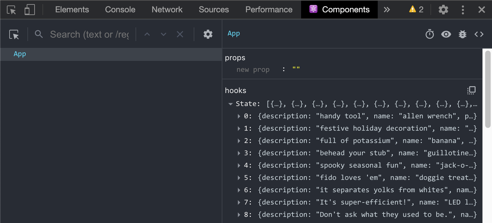

# Intro to React State

## Learning Objectives
 - Learn about state
 - Learn how to declare state in a React component
 - Learn how to iterate over some data and render it

<!--SEI1 5:23 -->

## State in React Components

At this point, we know that we can pass data into a React component by providing
props. This allows data to flow "downwards", from parent component to child
component. Where does this data originate from, though? What if we need to
frequently update that data?

So far, that data has just been an array or object in the global scope of the application. This is not ideal for dynamic data -- if the data changes, every
component needs to know that, so that it can decide whether it needs to
re-render anything that's changed. To achieve this, React components keep track
of data in an object (or multiple objects) called "state".

## State vs. Props

`state` and `props` have a lot in common:

- Changes to a component's props or state causes the component to re-render.
- Neither should be modified directly. (e.g. no `props.foo = 'bar'`).
- Both are optional. A React component doesn't need props or state to render
   markup to the DOM (it wouldn't be very useful with neither, though).

They are also different in a few key ways:

- Props are passed into a component from its parent. State is determined
   _within_ a component.
- Props are initalized by adding attributes in JSX,
  e.g. `<MyComponent coolProp="radical!" />`. State is declared in a component's
  [`useState`] (if we define one).
- Props can only be modified in the parent component. State is modified in
   the component itself, with a call to `useState`.

## Using State

Let's imagine we have a component that has a shopping cart.

At first, our cart is empty, so our `state` would likely have an empty array.

Then we add an item into our cart. We'd push an object like this one into our cart:

```js
{
  itemName: 'Jar of Speculoos',
  description: 'Imagine butter cookies dissolved in butter, made into cookie butter and stored in a jar. Stop imagining and now buy this!',
  price: 6.99
}
```

Now our view of our shopping cart will change, based on the data or the `state` of the shopping cart.

### Objective
Let's build a tiny online store and render the items available to us.


## Render a list


We want to be able to see an unordered list of our product names in the browser.

This is exactly what React is designed to do: render views based on data.

Let's set up our React app first, within this folder: as a reminder, we can do so with the following commands:

```sh
➜ npx create-react-app shopping-cart
➜ cd shopping-cart
```

After doing so, let's set up our React App. Move the data.js file from this repository into the `src` folder. Then, change the `App` component to look like this!

**App.js**

```jsx
function App() {
  return (
    <div>
      <h1>Big Time Shopping</h1>
    </div>
  )
}
```

<!--SEI1 5:41 -->

Currently, our app has no `state` (no data for our view). That's ok! Not all components have to have `state`. A simple navigation bar that is just 'hard coded' can be a react component - some components are just for presentation.

However, in the case of our online store, we'll want a list based on our data, so we will add `state`.

`state` is a special key word in react. In order to use `state` in our components we will have to use the `useState` hook. Here, we are __initializing__ state with our products array.


```jsx
import React, { useState } from 'react';
import productsData from './data';

function App() {
  const [products, setProducts] = useState(productsData); 
    return (
      <div>
        <h1>Big Time Shopping</h1>
      </div>
    )
}
```

We can look at our React dev tools and now see that our products are being stored in the `App` component's `state`.



Let's put the first product in there for rendering. We have to wrap any JS we want to render in curlies `{}`.

```jsx
return (
  <div>
    <h1>Big Time Shopping</h1>
    {products[0].name}
  </div>
)
```
We should see the allen wrench show up.

We can use is the `.map` function. `.map` will iterate over every item, manipulate it in some way, and return the new array.

In our case, we want to make an unordered list:


```jsx
return (
  <div>
    <h1>Big Time Shopping</h1>
    <ul>
      {
        products.map(product => {
          return <li>{product.name}</li>
        })
      }
    </ul>
  </div>
)
```

<!--SEI1 5:54 after questions -->

With ES6, if our function is one line of code (and no more), we can skip the curly braces after the arrow and we can skip the return statement - it will implicitly return the one line.

```jsx
return (
  <div>
    <h1>Big Time Shopping</h1>
    <ul>
      {
        products.map(product =>
          <li>{product.name}</li>
        )
      }
    </ul>
  </div>
)
```

In our case, we may also want to show the price, so let's update our code:

```js
<li>{product.name} - {product.price}</li>
```

<!--SEI1 6:07  after questions -->
